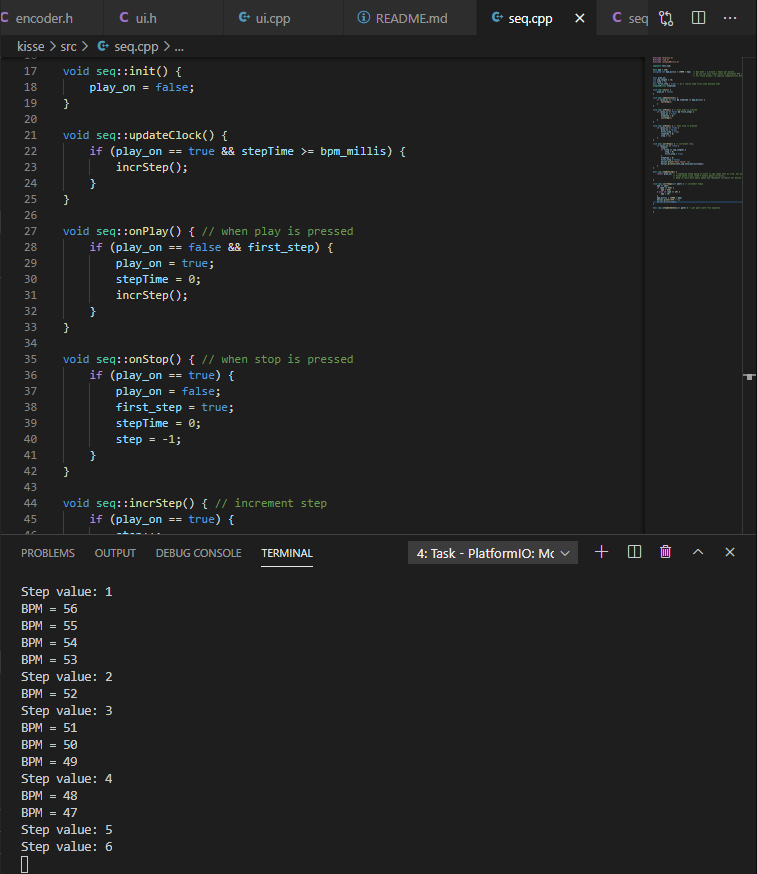
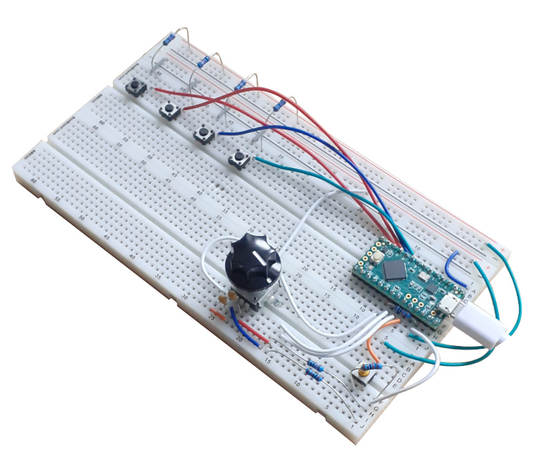

# KISSE ([K]eep [I]t [S]imple [SE]quencer)

A eurorack-format sequencer which is going to be part of my thesis work.

[Inspired by Super Sixteen by Matthew Cieplak](https://github.com/matthewcieplak/super-sixteen)

## Working at this moment

These are the features that are working as of now (this will be updated):

  * Encoder selection/value manipulation
  * Simple button scanning
  * Simple sequencer loop, with tempo, start, and stop controls

Take a look at the code [here!](./src/)

The schematics can be found [here!](./schematics/)

## What's it about?

This part will be updated in the future. The preliminary design documents are currently private and in Finnish. These will be translated and uploaded at a later time.

_The project's prototype at the moment_

## To-do

  * schematics
  * translation of design documents
