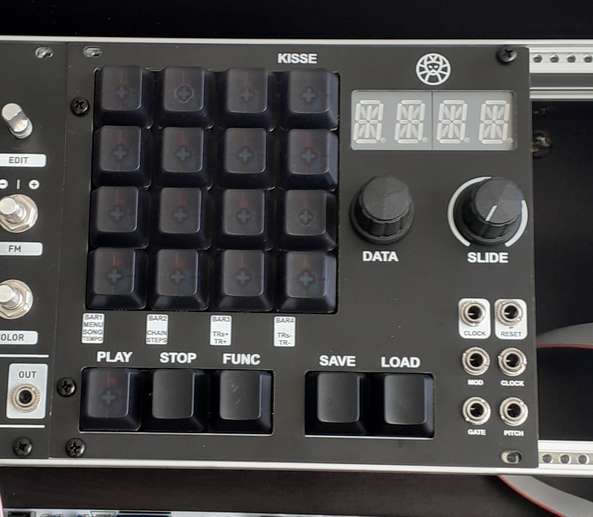
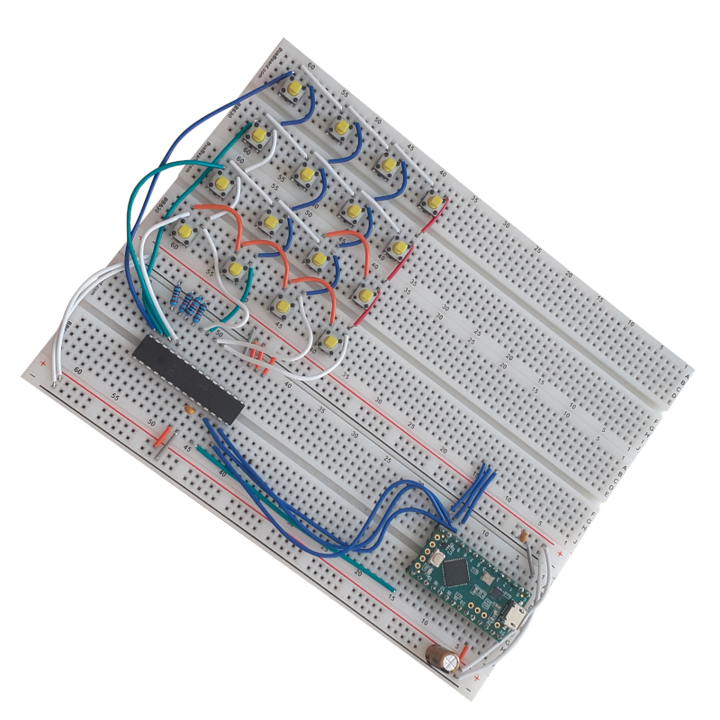

# KISSE ([K]eep [I]t [S]imple [SE]quencer)

A eurorack-format sequencer which is going to be part of my thesis work.

[Inspired by Super Sixteen by Matthew Cieplak](https://github.com/matthewcieplak/super-sixteen)

## Working at this moment

These are the features that are working as of now (this will be updated):

  * Encoder selection/value manipulation
  * Simple button scanning
  * Simple sequencer loop, with tempo, start, and stop controls
  * Button matrix scannig

Take a look at the code [here!](./src/)

The schematics can be found [here!](./schematics/)

## What's it about?

This part will be updated in the future. The preliminary design documents are currently private and in Finnish. These will be translated and uploaded at a later time.

Read of my progress below!!

## 10.03.2021

After a couple of weeks of struggling I managed to get the button matrix scanning working for the sequencer! The code is currently in **main.cpp**, but will be moved to its place in **buttons.cpp**.

The reason for using matrix scanning, instead of reading all the 16 buttons is to save IO-pins. I'm not even sure the **Atmega328** - which will be the MCU of choise in this project when it's time to build the actual device - has enough IO pins for that.

I had trouble with setting up the library, getting connection to the **MCP23S17** IC, and the the code was riddled with stupid mistakes which in hindsight should've been obvious to spot.

First mistake which took quite a while to notice, was that I accidentally reset the data I was reading from the **MCP23S17** to 0. The second mistake was that I had left the whole code responsible for the matrix scanning in a for-loop which I was using initially for testing. Meaning, the device did 4 times the scanning it should've.

The code is pretty much a carbon copy of the **Buttons.cpp** file from the **Super Sixteen**, but I went through the trouble of learning all the different things it did. When I first read the original code I had no idea what was going on (except the for loops and basic math).

I had to learn **bit manipulation** which I had never used before. I can definitely see its benefits now!

[Schematics can be found here!](./schematics/rev02.pdf)

_Button scanning working!_

_The device (so far)_

## 22.02.2021

I was able to create a light prototype of the sequencer! It didn't actually "play" any notes, but it did print the corresponding values to the serial monitor. With the encoder you could raise the tempo.

_The project's prototype at the moment_